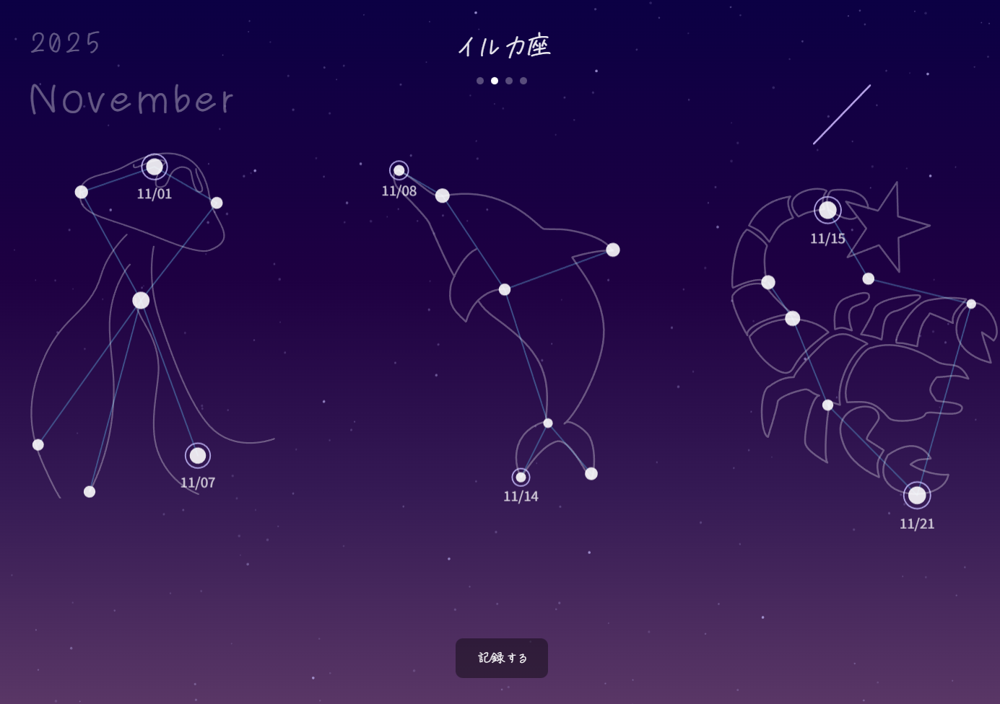

# P2HACKS2025 アピールシート
## プロダクト名

# Logstar （ログスター）
## コンセプト
日常のきらめきを、自分だけの星空に。

## 対象ユーザ
- 日記や記録を習慣化したいが、なかなか続かない人
- 日常の小さな幸せや「きらめき」を大切にしたい人
- 自分の日々の積み重ねを可視化して、達成感を得たい人
- クリエイティブで楽しい方法で毎日を振り返りたい人

### ペルソナ：佐藤 美咲（21歳・大学3年生）
**悩み**：日記が続かない／SNSに載せるほどではない小さな幸せを記録したい／日常に特別感がほしい

**Logstarを選ぶ理由**：写真＋一言だけの手軽さ、星が増える達成感、7日で星座完成という程よい目標設定

## 利用の流れ
- [logstar](https://pre-09.vercel.app/)へのリンクをクリックするとアプリが起動します。
- 「記録する」ボタンを押して、写真を選択し、一言メモを記録します。
- 写真内で一番キラキラしていると感じる場所を自分で選んで星を設置します。
- ホーム画面に星として表示されます。
- 別の星がある場合、星と星が線でつながります。
- ７日分記録すると星座決定ボタンが出て、今週分の星座に名前をつけられます。
- 星座に名前が付くと、星の周りにその形にあった絵が出てきます。
- 完成した星座はホーム画面に増えていきます
## 推しポイント
- **日常が「星」になる体験**：写真の中から自分がキラキラしていると感じる場所を選んで星を配置し、日常が自分だけの星空に変わる
- **7日間で星座完成の達成感**：1週間という程よい期間設定が、継続のモチベーションを生み出す
- **育てる楽しさ**：星座に名前をつけ、使い続けるほど自分だけの星空が広がっていく
- **自己肯定感の向上**：日々の小さな成功体験の積み重ねが、自分への自信につながる
- **シンプルなUI**：写真1枚＋一言メモだけで記録完了。日記が続かなかった人でも気軽に続けられる

## スクリーンショット(任意)

## 開発体制
### 役割分担
- chico：プロジェクトマネージャー・プロジェクトリーダー・プログラマー
- Kouhee：UIデザイナー・プログラマー
- ボクト：デザイナー・アピールシート作成
- てあとて：デザイナー・発表資料作成
### 開発における工夫した点
- **スケジュール管理**：「期間内に作りきる」を最優先とし、アプリとしての最低要件を定め、機能ごとに開発する優先度を明確にし、タスクを割り振った。
- **チーム連携**：Discordフォーラムで役割を超えた相談環境を整備し、問題を早期解決。
- **Git運用ルール**：ブランチ分離・レビュー必須・main直接push禁止等、ルールを定めコンフリクトを防止
- **進捗管理**：進捗フォーラムの活用、毎日のミーティングを通じて、タスクの偏りや遅延を早期に調整
- **AI活用ルール**：copilot-instructions.mdを作成し、コンテキストを共有、効率的なAI活用を行った。
## 開発技術
### 利用したプログラミング言語
- TypeScript
- HTML
- CSS
### 利用したフレームワーク・ライブラリ
- React 19
- Vite 7
- p5.js（星空・星座の描画）
- Dexie（IndexedDBラッパー、ローカルデータ保存）
- react-easy-crop（画像クロップ機能）
### その他開発に使用したツール・サービス
- ChatGPT
- GitHub
- Affinity
- VS Code
- Vercel
