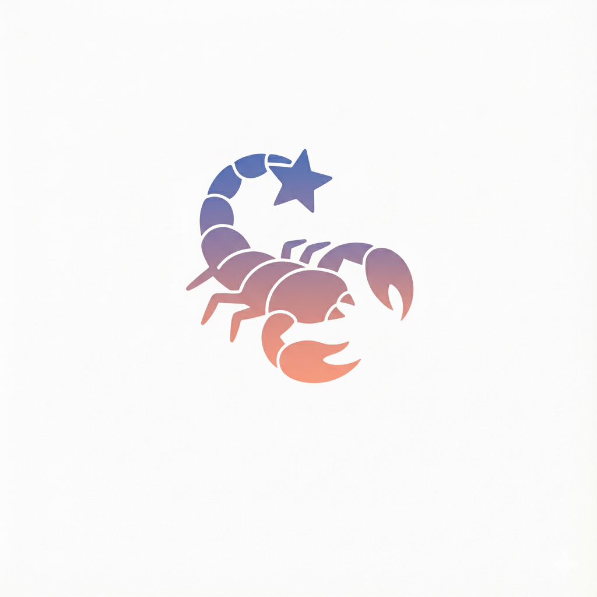

# P2HACKS2025 アピールシート
## プロダクト名

# Logstar （ログスター）
## コンセプト
日常のきらめきを星として浮かべ、星座として保存する。
## 対象ユーザ
悩み：生活にマンネリを感じているけれど、新しいことを始めようとは思えない人。\
楽しみ：落ちものパズルゲーム。ドラマ\
潜在的に抱えている問題：新しいことをいまさらやろうとは思えず、日常のマンネリを解消できないこと。落ち着いたデザインを好んでいるが、近年の派手や多彩な機能をもつアプリやゲームに苦手意識をもち、十分に遊べない問題。\
悩み：毎日のちょっとしたことを記録したいけれど、既存の記録ツールを使うことには堅苦しい印象をもっており、抵抗感があること。（１０～２０代女性および男性）\
楽しみ：充実している日々を過ごすこと。\
潜在的に抱えている問題：何気ない日常をゆったり記録したいが、既存の記録ツールに堅苦しさを感じている問題。何気ない日常を手軽に、楽しく記録したいけれどできない問題。
## 利用の流れ
- logstarへのリンクをクリックするとアプリが起動します。
- 「記録する」ボタンを押して、写真を選択し、一言メモを記録します。
- 写真内で一番光っていると感じる場所を自分で選んで星を設置します。
- ホーム画面に星として表示されます。
- 別の星がある場合、星と星が線でつながります。
- ７日分記録すると星座決定ボタンが出て、今週分の星座に名前をつけれます。
- 星座に名前が付くと、星の周りにその形にあった絵が出てきます。
- 完成した星座はホーム画面に増えていきます
## 推しポイント
特徴：日常を記録し、それが星となり日々の積み重ねが可視化される点。日常にある何気ないことをアプリと結び付けられる点。\
嬉しさ：毎日の記録が少しずつたまっていく喜び。毎日の星座を見て、自分はできるという実感がついてくる。７日間記録ができると星座が作られていき、利用を続けるほど自分なりの画面が作成されていく嬉しさ。
## スクリーンショット(任意)

## 開発体制
### 役割分担
- chico:プロジェクトマネージャー・プロジェクトリーダー・プログラマー
- Kouhee:ＵＩデザイナー・プログラマー
- ボクト:デザイナー
- てあとて:デザイナー
### 開発における工夫した点
開発を行う前に、開発スケジュールの見通しを考え、実行しました。\
期間内に作りきることを目標とし、適宜、開発内容を修正しました。\
各々が求める役割を担当し、開発に取り組みました。\
開発において問題や課題が発生した場合、役割を超えて相談し合い、開発しました。\
チーム全員で作業状況を共有し合い、開発が滞らないようにしました。\
プロジェクトマネージャーがチーム全体の作業を管理し、役割ごとの衝突が起こらないようにしました。
## 開発技術
### 利用したプログラミング言語
- TypeScript
- HTML
- CSS
### 利用したフレームワーク・ライブラリ
- React 19
- Vite 7
- p5.js（星空・星座の描画）
- Dexie（IndexedDBラッパー、ローカルデータ保存）
- react-easy-crop（画像クロップ機能）
### その他開発に使用したツール・サービス
- ChatGPT
- GitHub
- Affinity
- VS Code
- Vercel
